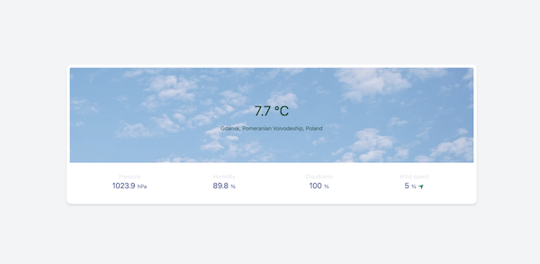
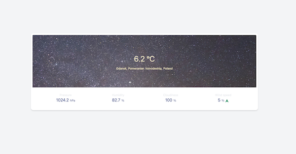

# Weather App

See application [here](https://pgalias.github.io/react-weather-app/)

## Table of Contents

* [About the project](#about-the-project)
    * [Built with](#built-with)
* [Getting started](#getting-started)
    * [Prerequisites](#prerequisites)
    * [Installation](#installation)
    * [Available commands](#available-commands)
* [Running application](#running-application)
* [Further changes](#further-changes)
* [Contact](#contact)

## About the project

This is small user interface of weather station. It is showing current air temperature and pressure, humidity, 
cloudiness and wind speed. It is using current user geolocation by builtin navigator functionality. Data about the 
weather are provided by [YR API](https://developer.yr.no) and data about the city are provided by reverse geocoding from
[Nominatim OpenStreetMap](https://nominatim.openstreetmap.org/reverse).

### Built with

- Typescript
- React
- Tailwind
- Jest

## Getting started

### Prerequisites

To use this project there is yarn package manager needed.

### Installation

To install all dependencies just run yarn command.

### Available commands

- `start` - runs dev server with HMR
- `build` - creates the bundle
- `test` - runs jest tests
- `test:watch` - runs tests in watch mode
- `lint` - runs eslint
- `format` - runs prettier 
- `build-to-branch` - builds application and deploy it to gh-pages branch

## Running application

1. Run application `yarn dev`
2. Go to `localhost:3000`

## Further changes

- Rather than showing an error when user refuses to use geolocation, show input to put postal code/city to fetch forecast data
- Use symbol code from the response to show current weather status by the icon (https://api.met.no/weatherapi/weathericon/2.0/documentation)
- Add weather information for the next hours
- Connect the application background with the symbol code - so when it is raining then show raining background, etc.  
- Fetch sunrise and sunset data
- Add the rest of the todo unit tests

## Contact

Pawel Galias - [linkedin](https://linkedin.com/in/pawgalias) - [pawel@galias.me](pawel@galias.me)

Project Link: [https://github.com/pgalias/react-weather-app](https://github.com/pgalias/react-weather-app)

Project Demo: [https://pgalias.github.io/react-weather-app/](https://pgalias.github.io/react-weather-app/)

Are you seeing bugs or potential improvements? Your feedback is more than welcome!
